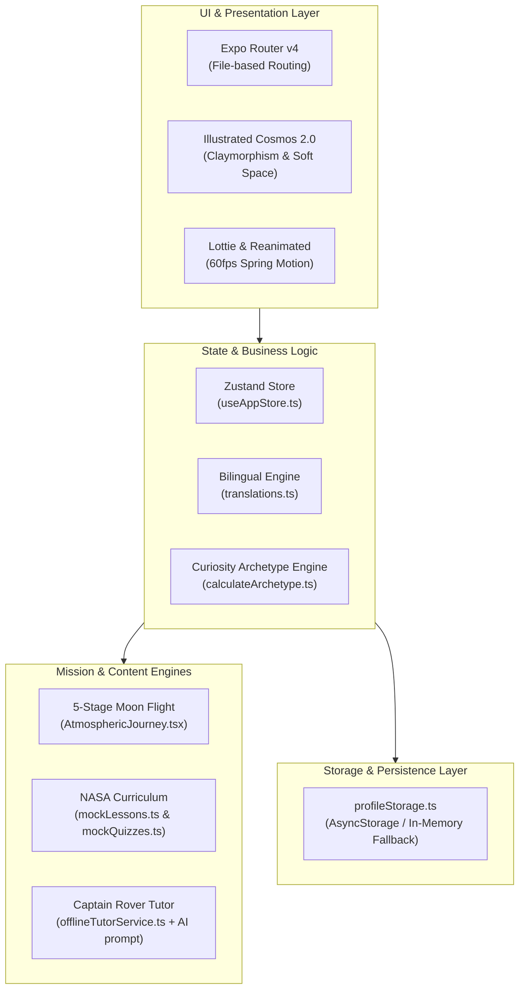

# 🚀 মহাকাশ জুনিয়র — Mohakash Jr.

<p align="center">
  
</p>

<p align="center">
  <strong>The Junior Astronaut Mission Trainer for the Next Generation of Stargazers</strong><br>
  <em>An offline-first, Bangla-first, NASA-backed educational space adventure for students in Bangladesh and worldwide.</em>
</p>

<p align="center">
  
  
  
  
  
  
</p>

---

## 🌌 Overview & Mission

**Mohakash Jr. (মহাকাশ জুনিয়র)** is an interactive mobile mission trainer created by **Team Aspire 5** for the **NASA Space Apps Challenge 2026**.

In Bangladesh and developing regions, millions of enthusiastic students (grades 6–10) dream of exploring the stars. However, they face significant hurdles:
- **Language Barriers**: Most NASA and space exploration materials exist exclusively in English with complex academic jargon.
- **Connectivity Gaps**: Over 60% of rural and semi-urban classrooms face spotty or nonexistent internet access.
- **Hardware Limitations**: Most students rely on budget Android smartphones or shared family devices.

**Mohakash Jr. dissolves these barriers.** It delivers real NASA astrophysics and planetary science through rich Bengali storytelling, local cultural analogies, full offline operability, an interactive 5-stage Moon landing simulator, and an AI space tutor named **Captain Rover**.

---

## 🌟 Key Features

### 1. 🪐 Interactive Space Destination Hub
Explore the solar system through the **Space Hub** (`src/components/SpaceHub.tsx`):
- **Earth-to-Moon Mission**: Live, fully playable 5-stage flight simulation.
- **Planetary Expeditions**: Mars, Jupiter, Saturn, and Venus missions with upcoming launch countdowns and scientific facts.
- **Dynamic Orbital Telemetry**: Visualizes orbital distances, surface temperatures, and exploration challenges.

### 2. 🌕 5-Stage Realistic Moon Mission Game (*Chondro Ovijan*)
A gamified space flight simulation built on authentic NASA Artemis engineering:
1. **Astronaut Suit-Up Game**: Put on 5 essential EVA protection layers (Thermal Micrometeoroid Garment, Helmet with Gold Visor, Pressurized Boots, Life Support PLSS Backpack, Comm Cap).
2. **Cryogenic Propellant Fueling Station**: Balance Liquid Hydrogen ($LH_2$) and Liquid Oxygen ($LOX$) cryogenic tanks to target pressure zones without over-pressurization.
3. **Cockpit Ignition Deck & Atmospheric Crossing**: Experience realistic multi-stage rocket flight:
   - **Prandtl-Glauert Supersonic Condensation Cone** at Mach 1 in the Troposphere.
   - **Solid Rocket Booster (SRB) Staging & Jettison** in the Stratosphere.
   - **Engine Vacuum Plume Expansion** in the Mesosphere & Deep Space.
   - **International Space Station (ISS) Flyby** at 400 km in the Thermosphere.
   - **Interactive Thruster Boost**: Real-time cockpit rumbling and velocity acceleration.
4. **Lunar Descent Module**: Guide the spacecraft through lunar gravity with retro-thrusters and hazard-avoidance radar.
5. **Moonwalk Celebration & Flag Ceremony**: Step onto the regolith, deploy scientific experiments, plant the flag, and earn **+120 XP**.

### 3. 📖 Illustrated NASA Curriculum & Storybook Reader
- **8 Comprehensive Lessons**: 4 Cadet-rank and 4 Astronaut-rank lessons authored from verified `science.nasa.gov` research.
- **Cultural Analogies**: Complex astrophysical principles explained through familiar Bengali concepts (e.g., gravitational slingshots compared to spinning *lathis*, atmospheric pressure compared to deep-river diving).
- **Sacred Bengali Typography**: Preserves Bengali conjunct ligatures (*juktakkhor*) and diacritic marks (*kar-fola*) with generous line-heights (1.88×) preventing text clipping.

### 4. 🤖 Captain Rover — Offline & Online AI Space Tutor
- **Offline First**: Instant answers (<5ms) to **114+ curated space FAQs** in Bengali, working seamlessly in 100% Airplane Mode.
- **Smart Fallback Engine**: Keyword matching and fuzzy intent classification.
- **Online AI Mentor Mode**: Proactive internet connectivity detection triggers live conversational answers from Captain Rover when connected.

### 5. 🧠 Cadet Psychometric Assessment & Archetypes
- No tedious username/password walls or boring test forms.
- Interactive 3-question curiosity orientation discovering genuine passions:
  - 🚀 **Rocket Pilot (রকেট পাইলট)**: Propulsion, orbital maneuvers, and high-speed flight.
  - 🔭 **Stargazer / Astronomer (নভোচারী পর্যবেক্ষক)**: Telescopes, exoplanets, and distant galaxies.
  - ⚙️ **Space Engineer (স্পেস ইঞ্জিনিয়ার)**: Rovers, solar arrays, and life support systems.
  - 🧪 **Alien Explorer (বহির্জাগতিক অনুসন্ধানকারী)**: Astrobiology, extreme organisms, and biosignatures.

### 6. 🌐 Instant Bilingual Localization Engine (Bangla 🇧🇩 & English 🇺🇸)
- Universal reactive localization toggle in the top command bar and settings.
- Translates every screen, lesson, quiz, debrief telemetry, HUD gauge, and dialog instantaneously without restarting.

### 7. 🛡️ Zero-Friction Local-First Architecture
- 100% on-device progression persistence via `src/services/profileStorage.ts`.
- Zero cloud account barriers; instant startup for students.
- Full privacy with one-tap "Delete All Local Data" reset option.

### 8. 🎨 "Illustrated Cosmos 2.0" Design System
- Warm soothing cream base (`#FAF7F2`) for daily strain-free reading.
- Immersive cosmic voids (`#0D1035`) for interactive space missions.
- Soft 3D Claymorphism with tactile bottom elevation lips and spring physics.
- Play Store benchmark safe-area insets accommodating Android gesture navigation bars.

---

## 🏗️ Architecture & Tech Stack



| Component | Technology | Description |
|---|---|---|
| **Framework** | Expo SDK 57 / React Native 0.81 | Cross-platform mobile development (Android, iOS, Web) |
| **Routing** | Expo Router | Modern file-based navigation with typed routes |
| **State Management** | Zustand | Ultra-fast lightweight atomic reactive state |
| **Persistence** | AsyncStorage / LocalStorage | Zero-cloud local-first storage for student progress |
| **Animations** | React Native Reanimated & Lottie | Smooth 60 FPS physics-based tactile spring animations |
| **Vectors & Graphics** | `react-native-svg` | Crisp responsive vector badges, spacecrafts, and celestial maps |
| **Typography** | Noto Sans Bengali & Hind Siliguri | Culturally protected high-legibility Bengali conjunct fonts |
| **Testing** | Node.js Test Runner / `tsx` | Fast native automated unit testing |

---

## 📁 Project Directory Structure

```text
mohakashjr/
├── app/                        # Expo Router file-based screens
│   ├── (tabs)/                 # Bottom tab bar layout
│   │   ├── index.tsx           # Cadet Flight Deck Dashboard
│   │   ├── lessons.tsx         # Illustrated NASA Curriculum
│   │   ├── mission.tsx         # Space Hub & 5-Stage Moon Mission
│   │   └── profile.tsx         # Astronaut Dossier & Settings
│   ├── lessons/[id].tsx        # Storybook Lesson Reader
│   ├── quiz/[id].tsx           # Interactive Quiz Arena
│   ├── onboarding.tsx          # 3-Step Cadet Curiosity Orientation
│   ├── splash.tsx              # Animated Blast-off Launch Screen
│   ├── tutor.tsx               # Captain Rover AI Space Mentor
│   └── _layout.tsx             # Root layout with font loaders
├── assets/                     # Design assets
│   ├── badges/                 # Vector SVG achievement badges
│   ├── brand/                  # App logo, launcher icon, splash icon
│   ├── fonts/                  # Noto Sans Bengali & Hind Siliguri
│   ├── illustrations/          # Hand-crafted space illustrations
│   └── lottie/                 # Mascot & rocket particle animations
├── src/                        # Core source code
│   ├── components/             # Reusable UI components
│   │   ├── mission/            # 5 Moon Mission Game stages
│   │   ├── AppLogo.tsx         # Animated vector brand logo
│   │   ├── ScreenHeader.tsx    # Universal inner-page header
│   │   ├── SpaceHub.tsx        # Planetary mission destination grid
│   │   └── StoryCard.tsx       # Soft 3D claymorphic story container
│   ├── content/                # NASA educational content & FAQs
│   │   ├── mockLessons.ts      # 8 Illustrated NASA Lessons
│   │   ├── mockQuizzes.ts      # 29 Per-lesson and placement quizzes
│   │   ├── offline_tutor.json  # 114+ Curated Bengali Space Q&As
│   │   └── spaceDestinations.ts# Solar system destinations configuration
│   ├── i18n/                   # Bilingual translations (Bangla & English)
│   ├── services/               # Local-first storage & AI tutor engine
│   ├── state/                  # Zustand app store & archetype logic
│   ├── theme/                  # Design tokens, colors, and typography
│   └── utils/                  # Haptics, audio, and device helpers
├── docs/                       # Project documentation & walkthroughs
└── tests/                      # 37 Automated unit tests
```

---

## 🚀 Getting Started

### Prerequisites
- [Node.js](https://nodejs.org/) (version 18.x or 20.x recommended)
- [npm](https://www.npmjs.com/) or [yarn](https://yarnpkg.com/)
- [Expo Go](https://expo.dev/go) on your mobile phone, or an Android/iOS emulator

### Installation

1. **Clone the repository**:
   ```bash
   git clone https://github.com/sheikhhossainn/mohakashjr.git
   cd mohakashjr
   ```

2. **Install dependencies**:
   ```bash
   npm install
   ```

3. **Start the Expo development server**:
   ```bash
   npx expo start
   ```

4. **Launch the application**:
   - **Android**: Press `a` in the terminal or scan the QR code with the Expo Go app.
   - **iOS**: Press `i` in the terminal or scan the QR code with the Camera app.
   - **Web**: Press `w` in the terminal to view in your browser.

---

## 🧪 Testing & Quality Assurance

Mohakash Jr. maintains a 100% passing automated test suite covering state management, localization, lesson progression, mission game mechanics, offline keyword search, and Bengali conjunct font metrics:

```bash
# Run the complete test suite (37 tests)
npm test

# Run TypeScript static type verification
npx tsc --noEmit
```

---

## 👥 Team Aspire 5 — NASA Space Apps Challenge 2026

- **Sheikh Hossain** — Project Lead, Architecture & Full-Stack Development
- **Mahim** — Moon Mission Mechanics & Motion Animations
- **Humaira** — NASA Curriculum Authoring, Bangla Content & Offline Q&As
- **Jim** — Typography, Asset Design & AI Tutor Experience

---

## 📄 License & NASA Acknowledgements

Educational space content, orbital data, and imagery citations derived from [NASA Science](https://science.nasa.gov), NASA Artemis Program, and NASA Jet Propulsion Laboratory (JPL).

Distributed under the **MIT License**. Built with ❤️ for the curious kids of Bangladesh and future astronauts worldwide.
