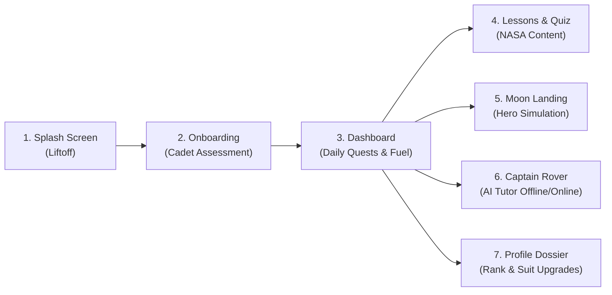

# 🚀 Mohakash Jr. — Step-by-Step App Walkthrough & Demonstration Guide
**Project:** Mohakash Jr. (মহাকাশ জুনিয়র)  
**Target Audience:** Hackathon Judges (NASA Space Apps Challenge), Students (Grades 6–10), Educators  
**Platform:** Expo / React Native (iOS, Android, Web)  
**Documentation Version:** 1.0.0  

---

## 🗺️ User Journey Architecture

---

## 📋 Walkthrough Matrix

| Step # | Screen Route | Key Objective | What to Show on Screen | What to Say / Explain |
|---|---|---|---|---|
| **Step 1** | `/splash` | Visual hook & orbital transfer | Earth-to-Mars orbital cruise, countdown timer, rocket blast-off animation, Astro-Buddy intro | Establishes energetic space adventure tone immediately. |
| **Step 2** | `/onboarding` | Curiosity orientation & identity | 3-question passion assessment, glowing vector badges, confetti explosion, Cadet Archetype reveal | No tedious sign-up forms; evaluates kid's natural passions to assign role (Pilot, Engineer, etc.). |
| **Step 3** | `/(tabs)/index` | Daily retention habit loop | Dark glass cockpit, Daily Fuel Cell Recharge (+25 XP), 2x2 tactile Bento Grid, rotating NASA facts | Duolingo-style gamification makes space science a daily habit kids look forward to. |
| **Step 4** | `/(tabs)/lessons` & `/lessons/[id]` | Real NASA science in mother tongue | 8 NASA lessons, Noto Sans Bengali typography, local cultural analogies, `science.nasa.gov` citations | Translates real NASA research into relatable Bengali story chunks without academic jargon. |
| **Step 5** | `/quiz/[id]` | Gamified knowledge validation | Spaceship console deck, tactile answer buttons, Astro-Buddy emotional reactions, Level-Up fireworks | Positive reinforcement: rewards XP, teaches through friendly hints, promotes Cadet ➔ Astronaut. |
| **Step 6** | `/(tabs)/mission` & `/mission` | Hero Feature: Moon Landing Simulation | Stage 1 Lunar site selector radar, Stage 2 Cockpit 500kg cargo game, Stage 3 Artemis telemetry debrief | Realistic resource management (oxygen, power, weight) matching actual NASA Artemis engineering. |
| **Step 7** | `/tutor` | 24/7 AI Space Mentor (Offline-First) | Quick chips, hybrid AI mentor, **Airplane Mode demonstration (<5ms instant response)** | 60%+ rural schools lack stable Wi-Fi; offline engine guarantees complete access anywhere. |
| **Step 8** | `/(tabs)/profile` | Astronaut credentials & rewards | Official NASA Mission ID dossier, dynamic suit upgrades, earned achievement badges | Validates scientific milestones with collectible NASA-styled astronaut badges. |

---

## 🎯 Step-by-Step Detailed Execution Guide

### 🚀 Step 1: The Launchpad & Splash Screen (`/splash`)

#### Objective:
Immerse the student or judge in a high-energy space adventure from the very first frame.

#### Navigation:
Open the app from a clean state. The app automatically launches into `/splash`.

#### On-Screen Actions:
1. **Orbital Cruise Visual**: Observe the Earth-to-Mars orbital transfer path with orbiting celestial bodies.
2. **Countdown & Blast-Off**: Watch the 3-2-1 countdown trigger the rocket thruster flames with particle effects and twinkling starfield.
3. **Mascot Welcome**: Astro-Buddy pops up from the flight console welcoming the cadet to the mission.
4. **Action**: Tap the glowing **"মিশন শুরু করো 🚀"** (Start Mission) button.

#### Explanation Script:
> *"Instead of a static corporate loading screen, Mohakash Jr. immerses kids immediately in a space journey from Earth to Mars. It sets an adventurous, high-energy tone from the first second."*

---

### 🧭 Step 2: Cadet Curiosity Assessment (`/onboarding`)

#### Objective:
Personalize the learning experience by evaluating the child's natural scientific curiosity without formal testing pressure.

#### Navigation:
Automatically transitions from Splash to `/onboarding`.

#### On-Screen Actions:
1. **Interactive 3-Question Story**:
   - **Question 1 (Core Passion)**: *"মহাকাশের কোন জিনিসটি তোমাকে সবচেয়ে বেশি টানে?"* (Options: Flying rockets, watching stars, building machines, searching for alien life).
   - **Question 2 (Field Action)**: *"একটি দূরবর্তী গ্রহে নামলে তুমি প্রথমে কী করবে?"* (Options: Collect soil samples, build base, chart stars, fly scout drone).
   - **Question 3 (Future Ambition)**: *"ভবিষ্যতে মহাকাশে তোমার সবচেয়ে বড় স্বপ্ন কী?"*.
2. **Multi-Select Vector Badges**: Tap the custom vector badges (`SpaceChoiceBadge`). Show that students can toggle multiple passions simultaneously.
3. **Form Validation**: Attempt to advance without selecting an option; demonstrate that the app ensures intentional participation.
4. **Confetti & Archetype Reveal**: Tap continue on Question 3. A celebratory victory confetti shower explodes, and Astro-Buddy reveals the student's earned **Cadet Archetype**:
   - E.g., **"স্পেস ইঞ্জিনিয়ার (Space Engineer)"** or **"রকেট পাইলট (Rocket Pilot)"** with an illuminated archetype insignia and personal motto.
5. **Action**: Tap **"কমান্ড ডেকে প্রবেশ করো 🛸"** to enter the main app.

#### Explanation Script:
> *"No dull username/password registration! We evaluate the child’s natural scientific curiosity using a child-friendly psychometric assessment. Their choices assign them a unique Cadet Archetype that customizes their dashboard missions, dialogue, and space suit."*

---

### 🛸 Step 3: Command Flight Deck Dashboard (`/(tabs)/index`)

#### Objective:
Demonstrate the daily habit-building engine and core navigation hub.

#### Navigation:
Main landing tab: **ড্যাশবোর্ড (Dashboard)**.

#### On-Screen Actions:
1. **Cadet Identity Banner**: Point out the cadet's name, current rank (**Cadet**), and active archetype badge in the cockpit header.
2. **Daily Fuel Cell Recharge (+25 XP)**:
   - Tap the glowing battery button.
   - Watch the energy plasma animation charge up with sound effects, instantly crediting **+25 XP** to the cadet's life-support tank.
3. **Astro-Buddy Holographic Comms**:
   - Astro-Buddy delivers personalized advice based on the cadet's archetype.
   - Tap **"তথ্য বদলাও"** to cycle through live verified NASA facts (James Webb Deep Field, Artemis program, solar flares).
4. **2x2 Bento Grid Navigation**:
   - **পাঠশালা (Lessons)**: Direct access to space curriculum.
   - **চন্দ্রাভিযান (Moon Landing)**: Hero mission simulation.
   - **কুইজ হাব (Quiz Hub)**: Quick challenge arena.
   - **প্রোফাইল (Profile)**: Astronaut dossier.
5. **Daily Cadet Quests (Duolingo-style)**:
   - "১টি লেসন সম্পন্ন করো" (Complete 1 lesson)
   - "কুইজে ৮০% মার্কস পাও" (Score 80% on a quiz)
   - "চন্দ্রাভিযানে কার্গো ব্যালেন্স করো" (Balance moon cargo)
6. **Action**: Tap the **"পাঠশালা"** card to open lessons.

#### Explanation Script:
> *"This dashboard uses a Duolingo-style retention loop. The daily fuel recharge and daily quests turn science education into a daily habit kids look forward to every morning."*

---

### 📚 Step 4: NASA Curriculum & Storybook Reader (`/(tabs)/lessons` & `/lessons/[id]`)

#### Objective:
Present authentic NASA scientific content translated into accessible Bengali with cultural resonance.

#### Navigation:
The **পাঠশালা (School)** tab.

#### On-Screen Actions:
1. **Rank-Gated Progression**:
   - Show the 4 **Cadet Lessons** (Solar System, Earth & Atmosphere, Rockets, Moon).
   - Show the 4 **Astronaut Lessons** (Black Holes, Mars Rovers, Exoplanets, Deep Space).
2. **Open Lesson 1: "সূর্য ও সৌরজগতের রহস্য"**:
   - **Bengali Typography**: Highlight the pristine font rendering (`Noto Sans Bengali` & `Hind Siliguri`) with custom line-height protection preventing diacritic and vowel clipping.
   - **Cultural Analogies**: Point out how complex orbital mechanics are explained using everyday Bangladeshi analogies (e.g., traditional spinning tops and carousels).
   - **NASA Citations**: Show the official `science.nasa.gov` reference citation card at the bottom of the story chunks.
3. **Action**: Tap the primary action button: **"কুইজ শুরু করো 🎮"**.

#### Explanation Script:
> *"All content is grounded in official NASA scientific databases, translated into engaging Bangla storybook chunks with relatable cultural analogies so kids intuitively understand the concepts."*

---

### 🎮 Step 5: Spaceship Quiz Deck Console (`/quiz/[id]`)

#### Objective:
Validate knowledge through supportive, gamified quiz mechanics without penalizing wrong answers.

#### Navigation:
Interactive quiz screen for the active lesson.

#### On-Screen Actions:
1. **Console Deck Layout**: The question is presented inside a tactile spaceship console with large, pressable touch targets.
2. **Interactive Answer Feedback**:
   - **Correct Answer**: The option glows emerald green, plays a positive audio chime, and Astro-Buddy pops up celebrating: *"অসাধারণ উত্তর, ক্যাডেট!"*.
   - **Incorrect Answer**: The button provides a soft-shake in coral red, with Astro-Buddy offering constructive hints rather than punitive failure.
3. **XP Accumulation & Level-Up**:
   - Completing quizzes fills the global XP bar. Once XP exceeds **200 XP**, the **Global Level-Up Modal** triggers with celebratory fireworks, promoting the user from **Cadet ➔ Astronaut**!
4. **Action**: Tap the **চন্দ্রাভিযান (Moon Mission)** tab at the bottom.

---

### 🌕 Step 6: The Hero Game — Moon Landing Mission (`/(tabs)/mission`)

#### Objective:
Showcase deep interactive physics and resource management simulation matching NASA's Artemis program.

#### Phase 6A: Lunar Site Selection Radar (`Screen 1`):
1. **Animated Lunar Radar Scanner**: Sweeps over 3 real lunar landing zones:
   - **Shackleton Crater (South Pole)**: High water ice, permanent shadow, high risk, highest scientific yield.
   - **Mare Tranquillitatis (Sea of Tranquility)**: Flat, sunny, Apollo 11 historical site, low risk.
   - **Oceanus Procellarum**: Volcanic terrain, moderate power and science.
2. **Selection**: Tap **Shackleton Crater** to inspect risk/reward telemetry and advance.

#### Phase 6B: Modern Cockpit Cargo Packing Mini-Game (`Screen 2`):
1. **Cockpit Telemetry HUD**:
   - Live payload weight readout: `০ / ৫০০ কেজি`.
   - 3 live resource linear gauges: Oxygen (💨), Power (⚡), and Science (🔬).
2. **Missing Essential Warning**:
   - Point out active alert: *"🚨 জরুরি সতর্কতা: প্রাথমিক অক্সিজেন সিলিন্ডার প্যাক করা হয়নি!"*.
3. **Pack Essential Items**:
   - Tap **"প্রাথমিক তরল অক্সিজেন সিলিন্ডার"**:
     - The button cleanly transforms into **`✓ প্যাকড`** in vibrant cyan without overlapping any text or badges.
     - Oxygen gauge jumps to **60%**, and weight bar updates to **140 / 500 কেজি (`৩৬০ কেজি বাকি`)**.
   - Tap **"পানি ও খাদ্য রেশন"** (Essential).
4. **Overweight Penalty Demonstration**:
   - Tap multiple heavy items until weight exceeds 500 kg.
   - Watch the HUD instantly flash coral red: *"⚠️ অতিরিক্ত ওজন! ল্যান্ডার ক্র্যাশ করার ঝুঁকি রয়েছে!"*. The launch button automatically disables for flight safety.
5. **Synergy Selection (Shackleton Strategy)**:
   - Unpack solar array (ineffective in dark crater).
   - Pack the **RTG Nuclear Battery** (+60% power) and **Lunar Ice Drill** (+45% science & extracts oxygen from ice).
   - The HUD turns emerald/cyan: *"৩৬০ / ৫০০ কেজি • ভারসাম্য নিখুঁত!"*.
6. **Action**: Tap **"অবতরণ সিমুলেশন শুরু করো 🚀"**.

#### Phase 6C: Descent & Artemis Mission Debrief (`Screen 3`):
1. **Descent Simulation**: Rocket thruster flames fire with altitude ticking down from 100 km to touchdown (0 km).
2. **Telemetry Debrief Score**:
   - Awards **3 Stars (নিখুঁত অবতরণ / Perfect Landing)**.
   - Displays real **NASA Artemis Insights** (how lunar water ice is split into liquid hydrogen and liquid oxygen for rocket propellant).
   - Awards **+110 XP** with animated counter.

#### Explanation Script:
> *"This isn't just a multiple-choice quiz; it's a realistic physics-and-resource management simulation. Kids must think critically about payload weight, power, and oxygen constraints—exactly like real NASA mission engineers."*

---

### 🛰️ Step 7: Captain Rover AI Space Mentor (`/tutor`)

#### Objective:
Demonstrate full 100% offline-ready accessibility for schools with limited or zero internet connectivity.

#### Navigation:
Tap the floating **"ক্যাপ্টেন রোভার এআই 💬"** button from the dashboard or header.

#### On-Screen Actions:
1. **Personalized Persona**: Captain Rover greets the student by name, rank, and archetype in natural, supportive Bengali.
2. **Quick Chips**: Tap a suggestion chip: *"চাঁদে কি সত্যিই পানি আছে?"* (Is there really water on the Moon?).
3. **THE AIRPLANE MODE DEMONSTRATION**:
   - **Toggle Wi-Fi / Mobile Data OFF** on the device.
   - Point out the active status badge: *"অফলাইন মোড সচল (Offline Active)"*.
   - Ask or tap: *"মহাকাশে নভোচারীরা কীভাবে বাথরুমে যান?"* (How do astronauts use the bathroom in space?).
   - **Result**: In less than **5 milliseconds**, Captain Rover delivers a full, child-friendly explanation from the embedded 30 offline Q&A dataset.
4. **Toggle Wi-Fi ON**:
   - Show how the tutor seamlessly elevates to an online cloud AI mentor backed by NASA prompt engineering.

#### Explanation Script:
> *"More than 60% of rural schools in developing regions lack stable internet. Mohakash Jr. is built 100% offline-first. Even in complete Airplane Mode with zero internet, students can learn, take quizzes, play the moon simulation, and talk to Captain Rover."*

---

### 👨‍🚀 Step 8: Astronaut Dossier & Mission ID (`/(tabs)/profile`)

#### Objective:
Deliver the emotional payoff of scientific progression and achievement.

#### Navigation:
The **প্রোফাইল (Profile)** tab.

#### On-Screen Actions:
1. **Official NASA Mission ID Dossier**:
   - Golden thermal visor astronaut helmet avatar.
   - Displays earned rank (**Astronaut**), assigned archetype (**Space Engineer**), total XP, completed lessons, and landing mission stats.
2. **Badges Showcase**:
   - Highlight earned vector badges: *লুনার পায়োনিয়ার*, *মিশন কমান্ডার*, *আর্টেমিস ফেলো*.
3. **Dynamic Suit Evolution**:
   - Point out that suit colors, patches, and visor tints update dynamically as rank advances from Cadet ➔ Astronaut ➔ Commander.

#### Explanation Script:
> *"Every milestone earns official NASA-styled credentials that validate their scientific effort and make kids proud of their learning achievements."*

---

## 💎 Key Talking Points for Pitch & Judging

1. **Mother Tongue Education**: Science is hardest when hindered by a language barrier. Delivering verified NASA science in Bengali makes space exploration accessible to over 250 million Bengali speakers worldwide.
2. **Zero-Internet Resilience**: All 8 lessons, 29 quizzes, 3-stage moon mission, and 30 AI tutor Q&As function seamlessly without an internet connection.
3. **Pedagogical Balance**: Blends passive story reading with active decision-making mini-games (payload balance, power synergy, risk evaluation).
4. **Clean Modern Design**: Tactile claymorphic controls, 3D bottom lips, neon glassmorphism, and responsive layouts tailored specifically for young learners.
